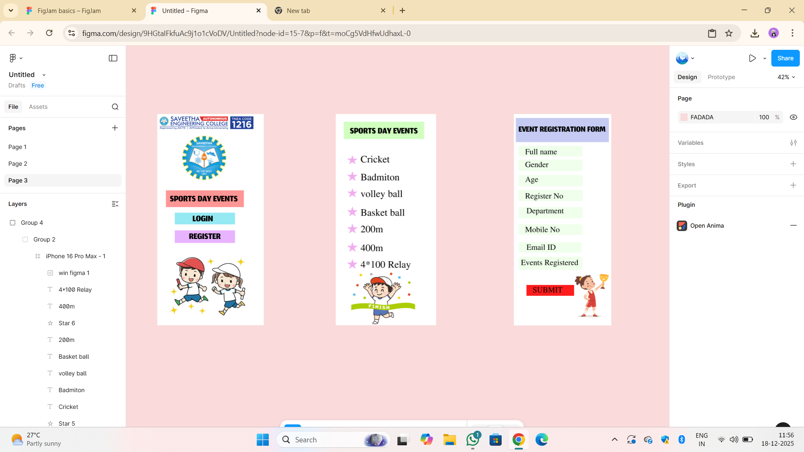

# Ex09 Event Registration Web Application
## Date:18-12-2025

## AIM:
To design, develop and deploy a web application for event registration using Figma UI tool.

## UI DESIGN TOOL:
Figma

## DESIGN STEPS:

### Step 1:
Use frames to represent screens or sections.

### Step 2:
Add column grids for consistent spacing and alignment.

### Step 3:
Insert shapes, text, buttons, and icons.

### Step 4:
Use Auto Layout for flexible, responsive design.

### Step 5:
Define color, text, and effect styles globally for consistency.

### Step 6:
Name layers logically and group related elements.

### Step 6:
Link frames to show navigation or interactions.

### Step 7:
Select the specific frame while generating code using Anima plugin.

## CODE:
```
table1
index1.html
<!DOCTYPE html>
<html>
  <head>
    <meta name="viewport" content="width=device-width, initial-scale=1" />
    <meta charset="utf-8" />
    <link rel="stylesheet" href="globals.css" />
    <link rel="stylesheet" href="style.css" />
  </head>
  <body>
    <div class="box">
      <div class="group">
        <div class="iphone-pro-max">
          
          
          <div class="rectangle"></div>
          <div class="text-wrapper">SPORTS DAY EVENTS</div>
          <div class="div"></div>
          <div class="text-wrapper-2">LOGIN</div>
          <div class="rectangle-2"></div>
          <div class="text-wrapper-3">REGISTER</div>
          
        </div>
      </div>
    </div>
  </body>
</html>

style1.css
.box {
  width: 440px;
  height: 956px;
}

.box .group {
  position: fixed;
  top: 0;
  left: 0;
  width: 440px;
  height: 956px;
  display: flex;
}

.box .iphone-pro-max {
  width: 440px;
  height: 956px;
  position: relative;
  background-color: #ffffff;
}

.box .logo {
  position: absolute;
  top: 7px;
  left: 4px;
  width: 436px;
  height: 66px;
  aspect-ratio: 6.65;
  object-fit: cover;
}

.box .sec {
  position: absolute;
  top: 98px;
  left: 113px;
  width: 200px;
  height: 200px;
  aspect-ratio: 1;
}

.box .rectangle {
  position: absolute;
  top: 345px;
  left: 39px;
  width: 352px;
  height: 76px;
  background-color: #ff9595;
}

.box .text-wrapper {
  position: absolute;
  top: 356px;
  left: 57px;
  width: 374px;
  font-family: "Jomhuria-Regular", Helvetica;
  font-weight: 400;
  color: #000000;
  font-size: 64px;
  letter-spacing: 0;
  line-height: normal;
  white-space: nowrap;
}

.box .div {
  position: absolute;
  top: 446px;
  left: 79px;
  width: 272px;
  height: 53px;
  background-color: #95e9f2;
}

.box .text-wrapper-2 {
  position: absolute;
  top: 446px;
  left: 159px;
  font-family: "Jomhuria-Regular", Helvetica;
  font-weight: 400;
  color: #000000;
  font-size: 64px;
  letter-spacing: 0;
  line-height: normal;
  white-space: nowrap;
}

.box .rectangle-2 {
  position: absolute;
  top: 526px;
  left: 79px;
  width: 272px;
  height: 57px;
  background-color: #e8b3ff;
}

.box .text-wrapper-3 {
  position: absolute;
  top: 526px;
  left: 143px;
  font-family: "Jomhuria-Regular", Helvetica;
  font-weight: 400;
  color: #000000;
  font-size: 64px;
  letter-spacing: 0;
  line-height: normal;
  white-space: nowrap;
}

.box .run-figma {
  position: absolute;
  top: 637px;
  left: 79px;
  width: 281px;
  height: 220px;
  aspect-ratio: 1.28;
}
table2
<!DOCTYPE html>
<html>
  <head>
    <meta name="viewport" content="width=device-width, initial-scale=1" />
    <meta charset="utf-8" />
    <link rel="stylesheet" href="globals.css" />
    <link rel="stylesheet" href="style.css" />
  </head>
  <body>
    <div class="box">
      <div class="group">
        <div class="iphone-pro-max">
          <div class="rectangle"></div>
          <div class="text-wrapper">SPORTS DAY EVENTS</div>
          
          
          
          
          
          
          <div class="div">Cricket</div>
          <div class="text-wrapper-2">Badmiton</div>
          <div class="text-wrapper-3">volley ball</div>
          <div class="text-wrapper-4">Basket ball</div>
          <div class="text-wrapper-5">200m</div>
          
          <div class="text-wrapper-6">400m</div>
          <div class="text-wrapper-7">4*100 Relay</div>
          
        </div>
      </div>
    </div>
  </body>
</html>

style2.css
.box {
  width: 440px;
  height: 956px;
}

.box .group {
  position: fixed;
  top: 0;
  left: 0;
  width: 440px;
  height: 956px;
  display: flex;
}

.box .iphone-pro-max {
  width: 440px;
  height: 956px;
  position: relative;
  background-color: #ffffff;
}

.box .rectangle {
  position: absolute;
  top: 35px;
  left: 36px;
  width: 363px;
  height: 78px;
  background-color: #d0ffbf;
}

.box .text-wrapper {
  position: absolute;
  top: 49px;
  left: 64px;
  font-family: "Jomhuria-Regular", Helvetica;
  font-weight: 400;
  color: #000000;
  font-size: 64px;
  letter-spacing: 0;
  line-height: normal;
  white-space: nowrap;
}

.box .star {
  top: 186px;
  height: 42px;
  position: absolute;
  left: 51px;
  width: 48px;
}

.box .img {
  top: 258px;
  height: 45px;
  position: absolute;
  left: 51px;
  width: 48px;
}

.box .star-2 {
  position: absolute;
  top: 335px;
  left: 51px;
  width: 48px;
  height: 42px;
}

.box .star-3 {
  top: 418px;
  height: 45px;
  position: absolute;
  left: 51px;
  width: 48px;
}

.box .star-4 {
  top: 495px;
  height: 45px;
  position: absolute;
  left: 51px;
  width: 48px;
}

.box .star-5 {
  top: 578px;
  height: 46px;
  position: absolute;
  left: 51px;
  width: 48px;
}

.box .div {
  position: absolute;
  top: 170px;
  left: 112px;
  width: 165px;
  font-family: "Jomolhari-Regular", Helvetica;
  font-weight: 400;
  color: #000000;
  font-size: 40px;
  letter-spacing: 0;
  line-height: normal;
}

.box .text-wrapper-2 {
  position: absolute;
  top: 251px;
  left: 112px;
  font-family: "Jomolhari-Regular", Helvetica;
  font-weight: 400;
  color: #000000;
  font-size: 40px;
  letter-spacing: 0;
  line-height: normal;
}

.box .text-wrapper-3 {
  position: absolute;
  top: 326px;
  left: 112px;
  font-family: "Jomolhari-Regular", Helvetica;
  font-weight: 400;
  color: #000000;
  font-size: 40px;
  letter-spacing: 0;
  line-height: normal;
}

.box .text-wrapper-4 {
  position: absolute;
  top: 411px;
  left: 112px;
  font-family: "Jomolhari-Regular", Helvetica;
  font-weight: 400;
  color: #000000;
  font-size: 40px;
  letter-spacing: 0;
  line-height: normal;
}

.box .text-wrapper-5 {
  position: absolute;
  top: 486px;
  left: 112px;
  font-family: "Jomolhari-Regular", Helvetica;
  font-weight: 400;
  color: #000000;
  font-size: 40px;
  letter-spacing: 0;
  line-height: normal;
}

.box .star-6 {
  top: 655px;
  height: 45px;
  position: absolute;
  left: 51px;
  width: 48px;
}

.box .text-wrapper-6 {
  position: absolute;
  top: 571px;
  left: 112px;
  font-family: "Jomolhari-Regular", Helvetica;
  font-weight: 400;
  color: #000000;
  font-size: 40px;
  letter-spacing: 0;
  line-height: normal;
}

.box .text-wrapper-7 {
  position: absolute;
  top: 646px;
  left: 112px;
  font-family: "Jomolhari-Regular", Helvetica;
  font-weight: 400;
  color: #000000;
  font-size: 40px;
  letter-spacing: 0;
  line-height: normal;
}

.box .win-figma {
  position: absolute;
  top: 710px;
  left: 50px;
  width: 328px;
  height: 246px;
  aspect-ratio: 1.33;
  object-fit: cover;
}

index3.html
<!DOCTYPE html>
<html>
  <head>
    <meta name="viewport" content="width=device-width, initial-scale=1" />
    <meta charset="utf-8" />
    <link rel="stylesheet" href="globals.css" />
    <link rel="stylesheet" href="style.css" />
  </head>
  <body>
    <div class="box">
      <div class="group">
        <div class="iphone-pro-max">
          <div class="rectangle"></div>
          <div class="text-wrapper">EVENT REGISTRATION FORM</div>
          <div class="div"></div>
          <div class="rectangle-2"></div>
          <div class="rectangle-3"></div>
          
          <div class="rectangle-4"></div>
          <div class="rectangle-5"></div>
          <div class="rectangle-6"></div>
          <div class="text-wrapper-2">Register No</div>
          <div class="text-wrapper-3">Department</div>
          <div class="text-wrapper-4">Mobile No</div>
          <div class="rectangle-7"></div>
          
          <div class="text-wrapper-5">Full name</div>
          <div class="text-wrapper-6">Gender</div>
          <div class="text-wrapper-7">Age</div>
          <div class="text-wrapper-8">SUBMIT</div>
          <div class="rectangle-8"></div>
          <div class="text-wrapper-9">Email ID</div>
          <div class="rectangle-9"></div>
          
        </div>
      </div>
    </div>
  </body>
</html>

style3.css
.box {
  width: 440px;
  height: 956px;
}

.box .group {
  position: fixed;
  top: -100px;
  left: 760px;
  width: 440px;
  height: 956px;
  display: flex;
}

.box .iphone-pro-max {
  width: 440px;
  height: 956px;
  position: relative;
  background-color: #ffffff;
}

.box .rectangle {
  position: absolute;
  top: 18px;
  left: 9px;
  width: 420px;
  height: 109px;
  background-color: #c4caf1;
}

.box .text-wrapper {
  position: absolute;
  top: 43px;
  left: 21px;
  width: 419px;
  font-family: "Jomhuria-Regular", Helvetica;
  font-weight: 400;
  color: #000000;
  font-size: 60px;
  letter-spacing: 0;
  line-height: normal;
}

.box .div {
  position: absolute;
  top: 144px;
  left: 21px;
  width: 289px;
  height: 48px;
  background-color: #efffeb;
  border-radius: 7px;
}

.box .rectangle-2 {
  position: absolute;
  top: 276px;
  left: 21px;
  width: 289px;
  height: 51px;
  background-color: #efffeb;
  border-radius: 7px;
}

.box .rectangle-3 {
  position: absolute;
  top: 206px;
  left: 21px;
  width: 289px;
  height: 53px;
  background-color: #efffeb;
  border-radius: 7px;
}

.box .register-no {
  position: absolute;
  top: 396px;
  left: 85px;
  width: 1px;
  height: 1px;
}

.box .rectangle-4 {
  position: absolute;
  top: 421px;
  left: 21px;
  width: 289px;
  height: 51px;
  background-color: #efffeb;
  border-radius: 7px;
}

.box .rectangle-5 {
  position: absolute;
  top: 499px;
  left: 21px;
  width: 289px;
  height: 47px;
  background-color: #efffeb;
  border-radius: 7px;
}

.box .rectangle-6 {
  position: absolute;
  top: 343px;
  left: 21px;
  width: 289px;
  height: 51px;
  background-color: #efffeb;
  border-radius: 7px;
}

.box .text-wrapper-2 {
  position: absolute;
  top: 343px;
  left: 51px;
  font-family: "Jomolhari-Regular", Helvetica;
  font-weight: 400;
  color: #000000;
  font-size: 32px;
  letter-spacing: 0;
  line-height: normal;
}

.box .text-wrapper-3 {
  position: absolute;
  top: 410px;
  left: 57px;
  font-family: "Jomolhari-Regular", Helvetica;
  font-weight: 400;
  color: #000000;
  font-size: 32px;
  letter-spacing: 0;
  line-height: normal;
}

.box .text-wrapper-4 {
  position: absolute;
  top: 495px;
  left: 51px;
  font-family: "Jomolhari-Regular", Helvetica;
  font-weight: 400;
  color: #000000;
  font-size: 32px;
  letter-spacing: 0;
  line-height: normal;
}

.box .rectangle-7 {
  position: absolute;
  top: 773px;
  left: 57px;
  width: 216px;
  height: 49px;
  background-color: #ff1c1c;
}

.box .WON {
  position: absolute;
  top: 718px;
  left: 272px;
  width: 157px;
  height: 210px;
  aspect-ratio: 0.75;
}

.box .text-wrapper-5 {
  position: absolute;
  top: 143px;
  left: 51px;
  width: 259px;
  font-family: "Jomolhari-Regular", Helvetica;
  font-weight: 400;
  color: #000000;
  font-size: 32px;
  letter-spacing: 0;
  line-height: normal;
}

.box .text-wrapper-6 {
  position: absolute;
  top: 201px;
  left: 51px;
  font-family: "Jomolhari-Regular", Helvetica;
  font-weight: 400;
  color: #000000;
  font-size: 32px;
  letter-spacing: 0;
  line-height: normal;
}

.box .text-wrapper-7 {
  position: absolute;
  top: 268px;
  left: 51px;
  font-family: "Jomolhari-Regular", Helvetica;
  font-weight: 400;
  color: #000000;
  font-size: 32px;
  letter-spacing: 0;
  line-height: normal;
}

.box .text-wrapper-8 {
  position: absolute;
  top: 768px;
  left: 85px;
  font-family: "Jomolhari-Regular", Helvetica;
  font-weight: 400;
  color: #000000;
  font-size: 32px;
  letter-spacing: 0;
  line-height: normal;
}

.box .rectangle-8 {
  position: absolute;
  top: 580px;
  left: 22px;
  width: 285px;
  height: 46px;
  background-color: #efffeb;
  border-radius: 7px;
}

.box .text-wrapper-9 {
  position: absolute;
  top: 575px;
  left: 57px;
  font-family: "Jomolhari-Regular", Helvetica;
  font-weight: 400;
  color: #000000;
  font-size: 32px;
  letter-spacing: 0;
  line-height: normal;
}

.box .rectangle-9 {
  position: absolute;
  top: 646px;
  left: 22px;
  width: 288px;
  height: 58px;
  background-color: #efffeb;
  border-radius: 7px;
}

.box .events-registered {
  position: absolute;
  top: 659px;
  left: 32px;
  width: 258px;
  height: 32px;
} 
```

## OUTPUT:


## RESULT:
The program to design, develop and deploy a web application for event registration using Figma UI tool is completed successfully.
